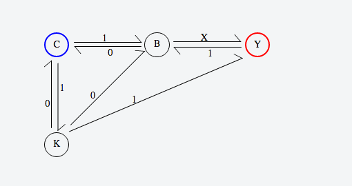

# machineJS

For COMS 3261 @ Columbia.  Not production ready as of now. 

An "English" flavored psuedo-language to take a description of a finite state machine and turn it into a native HTML/CSS web display.  The groundwork of this application is created but all the possible direction vectors need to be inputted as well as the modulo exceptions.  Ex:

*"start at C, C to B on 1, B to C on 0, B to Y on X, Y to B on 1, K to C on 0, C to K on 1, K to B on 0, K to Y on 1, end at Y"*



**How it works:**

```javascript
var input = "start at C, C to B on 1, B to C on 0, B to Y on X, Y to B on 1, K to C on 0, C to K on 1, K to B on 0, K to Y on 1, end at Y ";
mac = new machine(input, "#testcase");
```

The first input is the string to convert, and latter input is the name of the element to insert the computed FSM into.  

**Current commands:**<br>
`start at` : indicates state is the origin point.<br>
`end at` : indicates state is the end point.<br>
`a to b` : indicates an arrow drawn from state a to b.  States will be inserted as declared here. <br>
`a to b on 0` : indicates an arrow to be drawn with a label indicating the trigger<br>
<br><br>
Commas are optional, spaces are just as good. 
<br><br>
**Future commands:**
`declare a, b, c;` : indicates to raw input states in declared order<br>
`a to itself` : indicates an arrow to itself<br>
`spaced out` : indicates for states to spaced out every other state (optimal for 5 state machines)<br>
`""` : will treat quotes as a state with no parsing of conflicting keywords. Preserves spaces<br>
